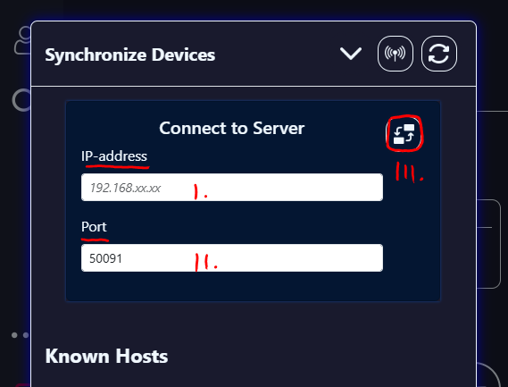

# L0CK3R


> **Disclaimer:**  
> L0CK3R is moreover a free-time project of mine. I tried to make it as secure as possible and because it operates offline on your local machine, the **risk of data breaches/exposures** to the public is **near 0**. However, just for legal reasons i want to say:  
> ***"I am not responsible for any kinds of incidents, where data got lost or stolen. The use of this Password-Manager is at one's own risk!"***

## What is ***L0CK3R*** ?

*"L0CK3R is a Password-Manager-Browser-Extension which originated in saved passwords in the Browser and hating to need an Internet connection to get **one's own** credentials stored in other Password-Managers like Nord-Pass or Proton-Pass..."*

So I developed <u>**L0CK3R**</u> to know exactly *how and where my personal data is stored*. Several other aspects, that were very important to me in the development process are:

* The credentials are **stored locally and encrypted** in a database on your machine
* **Offline synchronisation algorithms** with other Computers in your home-network
* **Autofill-Feature** for faster login
* **Infinite customization** possible

I would be happy to see you give it a try and getting feedback, or reports on bugs when found.

~ *[@2Sn00py4u](https://github.com/2Sn00py4u)*
  
## Installation

1. To install L0CK3R use the Github-Link or just download the ZIP-Archive

    

    ```sh
        git clone https://github.com/2Sn00py4u/L0ck3r.git
        cd L0ck3r
    ```

2. Activate ***Developer-Mode*** in your Browser and import the unpacked folder

    Go to *`Menu -> Extensions -> Manage Extensions`*  
    > The path varies between some Browsers

    

    Enable Developer-Mode

    

    Load the Extension
    > Load unpacked -> navigate to L0ck3r -> choose folder

    

    The extension is loaded, **but** for the final installation you will need to copy your Extension-ID

    

3. Find the *`backend/setup/installer.py`* and execute it via `python.exe` 
   > :warning: Note: python version 3.12.5 or higher is required!  
   > > to check the version use `python.exe --version`  

   

    ```sh
        python.exe .\backend\setup\installer.py
    ```

    It will install a few python-packages and create the necessary [Native-Messaging-Host](https://developer.chrome.com/docs/extensions/develop/concepts/native-messaging) for it to work, after providing the copied Extension-ID.

    

4. Reload the Extension and register yourself locally  

    To reload the Extension you have to click the reload-button in the Extension-Manager of your Browser.

    

    > :warning: It is very important, that the default way to open an .py-file is via `python.exe` and **not** with a text editor!  

    I. Click on the Extension-Icon in the menu-bar  
    II. Choose L0ck3r  
    III. Go to the Register-Tab and create an account of your choice  

    


*Congratulations!*  
*You **successfully built** the L0ck3r-Browser-Extension.*  
*Hope you enjoy.*  

## Synchronisation

To synchronise to computers go to the *Sync Devices*-Tab.


1. Connecting to a Sync-Server (your second device) in your home-network

    

    I. Enter the IP address of the Sync-Server  
    > To get your IP type `ipconfig` in the command-line  

    II. Enter the connection-Port of the Sync-Server  
    III. Hit the connect button and get synchronised  

2. Hosting a Sync-Server

    

    I. Enter a hosting Port between 49152 and 65535, or use the default Port `50091`  
    II. Enter the maximum time limit for a client to connect (default 10 sec.)  
    III. You can host or cancel the hosting  
    IV. You can see the Server-IP and Port while hosting. Use this to connect to a Sync-Server like in the previous explanation.  

3. Refresh the *Known Hosts* list

    

    Every new connection you establish will be shown in the *Known Hosts list*, so it's much easier and faster to synchronise with this device again.

## Sources

### Assets

#### Icons

<a href="https://www.flaticon.com/authors/pixel-perfect" title="Pixel perfect"> Pixel perfect </a>  
<a href="https://www.flaticon.com/free-icons/delete" title="delete icons">Delete icons created by Arkinasi - Flaticon</a>  
<a href="https://www.flaticon.com/free-icons/instagram-logo" title="instagram logo icons">Instagram logo icons created by Pixel perfect - Flaticon</a>  
<a href="https://www.flaticon.com/free-icons/google" title="google icons">Google icons created by Freepik - Flaticon</a>  
<a href="https://www.flaticon.com/free-icons/user" title="user icons">User icons created by Freepik - Flaticon</a>  
<a href="https://www.flaticon.com/free-icons/discover" title="discover icons">Discover icons created by Smashicons - Flaticon</a>  
<a href="https://www.flaticon.com/free-icons/more" title="more icons">More icons created by Kirill Kazachek - Flaticon</a>  
<a href="https://www.flaticon.com/free-icons/logout" title="logout icons">Logout icons created by Afian Rochmah Afif - Flaticon</a>  
<a href="https://www.flaticon.com/free-icons/password" title="password icons">Password icons created by Freepik - Flaticon</a>  
<a href="https://www.flaticon.com/free-icons/plus" title="plus icons">Plus icons created by Fuzzee - Flaticon</a>  
<a href="https://www.flaticon.com/free-icons/show-password" title="show password icons">Show password icons created by Stasy - Flaticon</a>  
<a href="https://www.flaticon.com/free-icons/password" title="password icons">Password icons created by th studio - Flaticon</a>  
<a href="https://www.flaticon.com/free-icons/copy" title="copy icons">Copy icons created by Maxim Basinski Premium - Flaticon</a>  
<a href="https://www.flaticon.com/free-icons/tick" title="tick icons">Tick icons created by feen - Flaticon</a>  
<a href="https://www.flaticon.com/free-icons/picture" title="picture icons">Picture icons created by Superndre - Flaticon</a>  
<a href="https://www.flaticon.com/authors/riajulislam" title="riajulislam"> riajulislam </a>  
<a href="https://www.flaticon.com/authors/freepik" title="Freepik"> Freepik </a>  
<a href="https://www.flaticon.com/authors/uniconlabs" title="Uniconlabs"> Uniconlabs </a>  
<a href="https://www.flaticon.com/free-icons/refresh" title="refresh icons">Refresh icons created by Uniconlabs - Flaticon</a>  
<a href="https://www.flaticon.com/free-icons/signal" title="signal icons">Signal icons created by Freepik - Flaticon</a>  
<a href="https://www.flaticon.com/authors/pixel-perfect" title="Pixel perfect"> Pixel perfect </a>  
<a href="https://www.flaticon.com/free-icons/arrow" title="arrow icons">Arrow icons created by Freepik - Flaticon</a>

## Easter Egg

*"I dedicate L0CK3R to you and only you.*  
*As well as the delicacy on 22/09/2024 in the noon..."*

## Release

|             | **Information**                                           |
| :---------: | :-------------------------------------------------------- |
| **Version** | 1.0 (beta)                                                |
|   **OS**    | windows 10 or higher (tested)                             |
| **Browser** | chrome-based (tested)  *Google-Chrome, Opera, Brave etc.* |

### Contributors


*[@2Sn00py4u](https://github.com/2Sn00py4u)*
